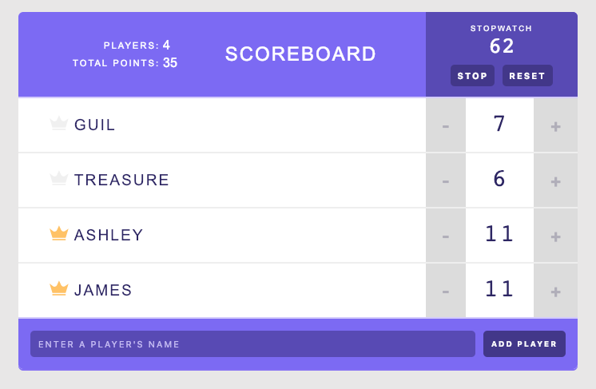

# Mini Project: React Scoreboard

<br/><br/>

## [Live App](https://scoreboard-react-l3hgpcphy-nicopixels-projects.vercel.app/)

__________

## Why this Project?

This project is a simple, quick experiment aimed at solidifying the foundational knowledge of React. It's perfect for trying out new concepts or testing ideas in a controlled, small-scale environment. The use of class components in this project helps understand React's older component model and lifecycle methods, which is still relevant for maintaining and working with legacy React applications.

This is a valuable exercise for anyone who wants to get comfortable with basic React principles such as:

- State management
- Handling user inputs
- Component communication
- Component reusability

## Explore More Projects

If you are interested in exploring more mini projects like this one, check out my [GitHub mini project list](https://github.com/stars/nicopixeldev/lists/mini-project).

## Project Description

This is a small, quick project aimed at experimenting or prototyping new ideas using React. The goal is to learn the basics of React, understand the differences between class components and functional components, explore state management, lifecycle methods, and how to split the user interface into reusable and composable components.

This project uses **React class components** to demonstrate the fundamental concepts of React development. It also serves as a simple and effective way to dive deeper into React's state management and component interaction.


## Components Description

- **App**: The main component and one of the few with state. All the logic and state management for the app are kept in this component.
- **AddPlayerForm**: A form component that allows users to add new players to the scoreboard.
- **Counter**: A child component of each Player that handles the logic for adding or subtracting points.
- **Header**: The parent component for Stats and Timer.
- **Icon**: A small icon with binary behavior that shows a crown next to the player's name.
- **Player**: A component that groups the Counter and Icon components for each player.
- **Stats**: Displays the total stats, such as the number of players or total points scored.
- **Timer**: A component with state that displays a small timer with start and reset buttons.


## Setup and Installation

To get started with this project:

1. Clone the repository:
   ```bash
   git clone https://github.com/nicopixeldev/scoreboard.git
   ```
2. Install the dependencies:
   ```bash
   npm install
   ```
3. Start the development server:
   ```bash
   npm start
   ```

This will start the React app locally at `http://localhost:3000`.

